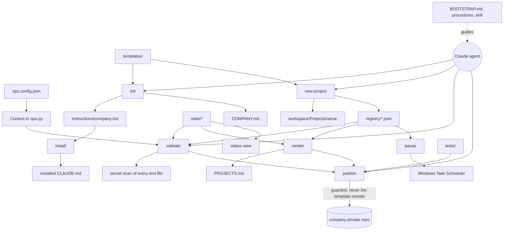

# System architecture

## Overview

The repository is both the public template and, once initialized, one company's private records ([[template-and-company-copy-modes]]). Its parts:

| Part | Files | Role | Owned by |
|---|---|---|---|
| Configuration | `ops.config.json` | Company name and time zone, workspace root and projects folder, business functions, standing skills, instructions source and install target, template upstream and the `bootstrapped` flag | company copy after `init` |
| Registry | `registry/*.json` (projects, automations, assets, systems with `shared_surfaces`, access) | What the company depends on; references, never values | company |
| State | `state/observations.json`, `state/queue.json`, `state/history.jsonl`, `state/decisions.md` | Dated status with time-to-live, ranked work, append-only history and decisions | company (T-entries in decisions ship with the template) |
| Generated views | `PROJECTS.md`, the `status` output | Rendered from the JSON, never hand-edited | generated |
| Instructions | `templates/company-instructions.md` → `instructions/company.md` → installed target | Company-wide rules every session loads | template → company |
| Playbooks | `BOOTSTRAP.md`, `procedures/*.md`, `.claude/skills/operations-center` | How an agent sets up and runs the operations center | template |
| Tool | `tools/ops.py` | init, validate, render, status, new-project, observe, record, pause, install, publish | template |
| Tests and CI | `tests/`, `.github/workflows/tests.yml` | Tool behaviour, plus validity of whichever records the copy holds ([[test-suite-runs-in-every-copy]]) | template |
| Worked example | `examples/<fictional company>/` | A complete, valid, fictional company | template |

The design decisions behind this layout are T-1 (JSON records, generated views), T-2 (stable IDs), T-3 (expiring status), T-4 (records in a workspace subfolder) and T-5/T-6 (user-level install, short instructions) in `state/decisions.md`.

## Module graph

## Constraints

- **Standard library only, Python 3.10+.** No install step besides Git.
- **Every write through the tool is validated first.** `new-project` and `observe` validate the would-be records before writing, and write nothing if an error results. JSON is written atomically (temporary file, then replace) with LF line endings.
- **Byte-for-byte comparisons.** `render --check`, the PROJECTS.md test and the instructions drift check compare bytes, so line endings are pinned to LF ([[windows-and-posix-parity]]).
- **The secret scan covers the whole repository**, including this brain ([[repository-wide-secret-scan]]).
- **The tool never overwrites a project's own files** when scaffolding, and `init` keeps edited company files unless `--force` is given.
- **`install` keeps a timestamped backup** of the file it replaces, and reports drift byte for byte.
- **Company records never reach the template remote** (T-8), and template changes never touch company records ([[template-upgrade-by-merge]]).
