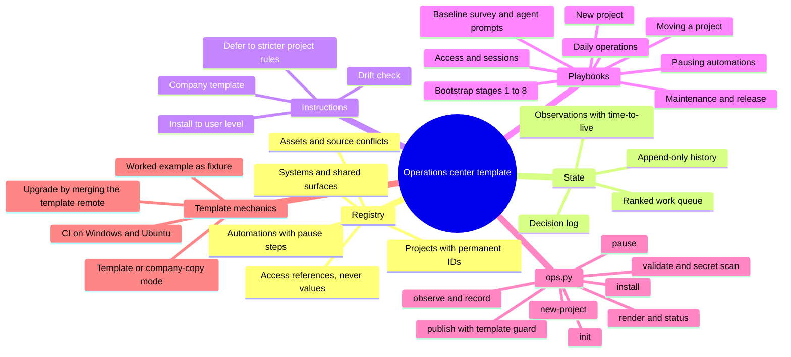

# Feature mindmap

## Feature mindmap

Decisions behind the branches: T-1 to T-8 in `state/decisions.md`; [[template-and-company-copy-modes]], [[template-upgrade-by-merge]], [[repository-wide-secret-scan]], [[windows-and-posix-parity]], [[test-suite-runs-in-every-copy]], [[brain-describes-the-template]].
