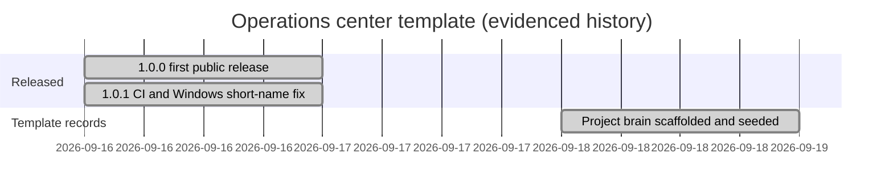

# Roadmap

## Milestones

Release history is canonical in `CHANGELOG.md`; this page only places it on a timeline. The repository records no template roadmap beyond its current release, so the items after it are open questions, not commitments.

## Candidate next steps (named in the repository, not scheduled)

These come from `BOOTSTRAP.md` ("After bootstrap"), `procedures/daily-operations.md` and the README. They describe stages a **company copy** grows into. Whether the template should ship support for them is an open question.

- **Scheduled read-only health check** that refreshes observations. `daily-operations.md` says that, when built, it belongs in the repository's `tools/`, runs on a scheduler that needs no sign-in, and writes only observations.
- **Daily email and dashboard** generated from `state/` (T-1 anticipates them).
- **Per-repository commit policy** for machines with an auto-commit hook (`maintenance-and-release.md`).
- **Consolidating copied credentials** (`access-and-sessions.md`).

## Open questions for maintainers

- Should the health check, email or dashboard ship in the template, or stay company-built?
- Should `pause --apply` gain non-Windows schedulers?
- How will a future `schema_version` change reach company copies that upgrade by merge ([[template-upgrade-by-merge]])?
- Should `BOOTSTRAP.md` gain an explicit step to keep or remove this brain ([[brain-describes-the-template]])?
