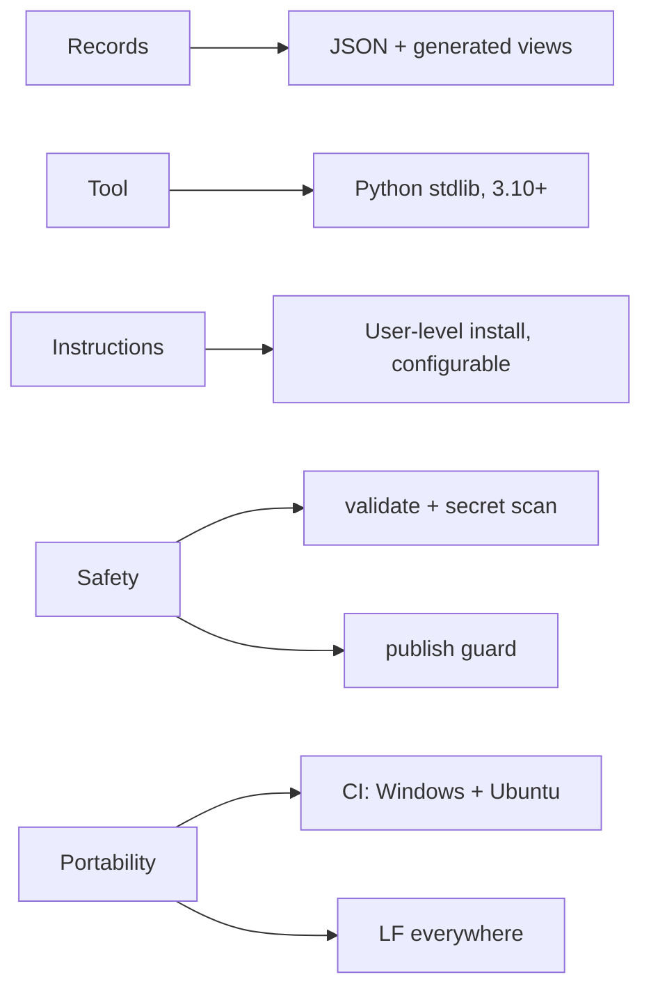

# Tech stack

## Technology choices

| domain | candidates | decision | rationale |
|---|---|---|---|
| Tool language | Python | Python 3.10+, standard library only | Runs on any machine with Python and Git, with no install step (T-1) |
| Record format | database; YAML; JSON | JSON records (`registry/`, `state/`), JSON Lines for history, Markdown for decisions | Machine-checkable, diffable, and readable by any future email or dashboard generator (T-1) |
| Views | hand-maintained docs; generated | `PROJECTS.md` and `status` generated by `ops.py` | Every view agrees with the records (T-1) |
| Agent guidance | code; docs | Markdown playbooks (`BOOTSTRAP.md`, `procedures/`) plus one Claude Code skill | The agent does the work; the tool only checks, renders and guards |
| Instructions delivery | per-project imports; user-level file | Copy `instructions/company.md` to `~/.claude/CLAUDE.md` by default, configurable | Loads in every session without import approvals (T-5) |
| Version control | Git | Git; the GitHub CLI optionally, to create the private repo | A company copy is an ordinary private repository |
| Scheduler control | per-OS automation | Windows Task Scheduler via PowerShell for `pause --apply`; manual steps for the rest | Only Windows is automated today; see open items |
| Tests | unittest; pytest | `unittest` (pytest also collects it) | Standard library, matching the tool |
| CI | GitHub Actions | Ubuntu and Windows × Python 3.10 and 3.13; runs the tests and `validate --no-paths` | Lowest and a current supported Python, on both path and line-ending conventions ([[windows-and-posix-parity]]) |
| Line endings | platform default; LF | LF for everything (`.gitattributes`) | Generated files are compared byte for byte |
| License | | MIT | Public template meant to be copied |

## Decision mindmap

## Open items

- `pause --apply` automates only Windows Task Scheduler. cron, launchd, systemd timers and Claude routines rely on their registered manual pause step.
- Every file carries `schema_version: 1`, but no migration mechanism exists yet (there has been no schema change so far).
- The scheduled read-only health check, and a daily email or dashboard generated from `state/`, are named as next stages but are not part of the template.
